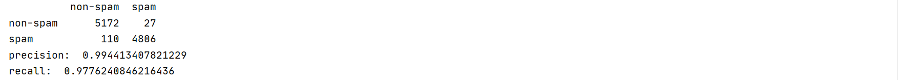

## SVM小作业

### 原理简述

寻找能够正确划分训练数据集并且**几何间隔最大**的分离超平面。

对于给定的数据集 $T$ 和超平面 $\omega \cdot x + b = 0$ ，定义超平面关于样本点 $(x_i, y_i)$ 的几何间隔为：
$$
\gamma_i = y_i(\frac{\omega}{\Vert \omega \Vert} \cdot x_i + \frac{b}{\Vert \omega \Vert})
$$
并使其最大化。

### 代码解释

主要参考附录。

#### utils.py

对拼接文件路径进行简单的封装。

```python
def resolve(root, file):
    return join(root, file)
```

#### process.py

对数据进行处理，分割成数据和标签，并保存在npy文件中。

```python
def get_email_content(dataset_dir):
    files = []
    labels = []
    # ham emails
    for f in listdir(dataset_dir):
        d = resolve(dataset_dir, f)
        if isdir(d):
            ham = resolve(d, 'ham')
            for fi in listdir(ham):
                email_path = resolve(ham, fi)
                if isfile(email_path):
                    files.append(email_path)
                    labels.append(1)
    # spam emails
    for f in listdir(dataset_dir):
        d = resolve(dataset_dir, f)
        if isdir(d):
            spam = resolve(d, 'spam')
            for fi in listdir(spam):
                email_path = resolve(spam, fi)
                if isfile(email_path):
                    files.append(email_path)
                    labels.append(0)
    # construct email matrix
    email_matrix = ndarray((len(files),), dtype=object)
    email_id = 0
    for f in files:
        with open(f, 'r', errors='ignore') as fi:
            next(fi)
            data = fi.read().replace('\n', ' ')
            email_matrix[email_id] = data
            email_id += 1
    return email_matrix, labels


# save processed data
dataset_path = resolve(getcwd(), 'dataset')
email_data, email_labels = get_email_content(dataset_path)
train_X, test_X, train_y, test_y = train_test_split(email_data, email_labels, test_size=0.3, random_state=7)
save('train/train_X.npy', train_X)
save('train/train_y.npy', train_y)
save('test/test_X.npy', test_X)
save('test/test_y.npy', test_y)
```

#### svm.py

核心部分与附录大致相同，划分训练集和测试集后，调用sklearn的svm进行处理。

值得一提的是，因为numpy自身的bug，无法正确从npy文件中读取数据，因此采用了一个tricky的方案：

```python
# load data
# save np.load
np_load_old = np.load
# modify the default parameters of np.load
np.load = lambda *a, **k: np_load_old(*a, allow_pickle=True, **k)
# call load_data with allow_pickle implicitly set to true
train_X = np.load('train/train_X.npy')
train_y = np.load('train/train_y.npy')
test_X = np.load('test/test_X.npy')
test_y = np.load('test/test_y.npy')
# restore np.load for future normal usage
np.load = np_load_old
```

### 实验结果

准确率：99.44%

召回率：97.76%

